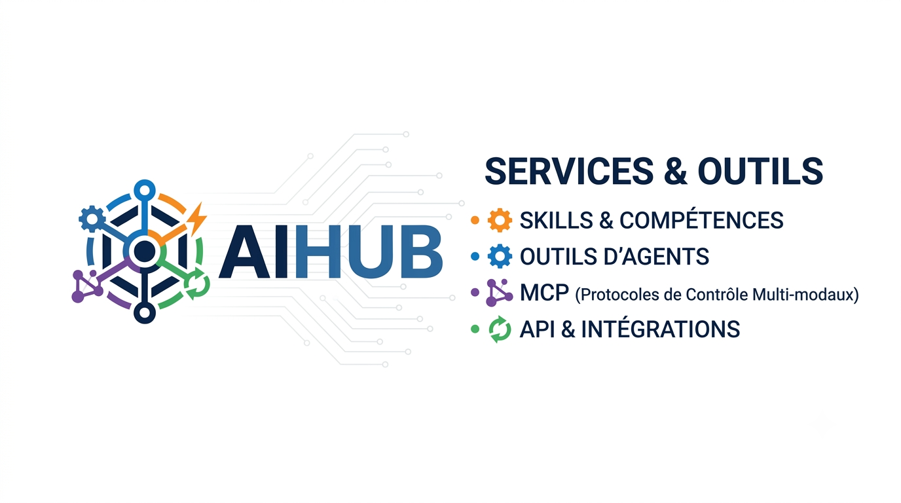

# AIHub



Open ecosystem for discovering, installing and managing AI skills, tools, MCP servers and agents.

## Structure

```text
aihub/
├── registry/     # registry.json - index of all available packages
├── skills/       # AI skills: guidance loaded into an agent's context
│   ├── code-management/
│   ├── code-review/
│   └── organization/
├── tools/        # AI tools: executable programs for agents
│   ├── web-search/    # DuckDuckGo search
│   ├── calculator/    # safe arithmetic evaluation
│   └── filesystem/    # sandboxed file access
├── mcp/          # MCP servers (coming soon)
├── agents/       # Agents (coming soon)
├── packages/     # Bundles (coming soon)
├── cli/          # AIHub CLI (coming soon)
└── website/      # AIHub website (coming soon)
```

## Packages

Each package contains a `manifest.json` (the AIHub contract) plus its content.

- **Skills** are instructions (`skill.md`) loaded into an agent's context. They require no permissions.
- **Tools** are executable programs (`main.py`) with declared permissions.

See `registry/registry.json` for the full index.

## Roadmap

- [x] Define manifest.json contract
- [x] Create registry.json
- [x] Add test packages (3 tools + 3 skills)
- [x] AIHub CLI: search, info, install, uninstall, list, update
- [ ] Website with automatic registry sync
- [ ] GitHub Actions validation for PRs
- [ ] Download counts (see `docs/COUNTS-API.md`)

## Related repositories

- [ai-hub-cli](https://github.com/Aaron-arn/ai-hub-cli) — the `aihub` command line tool
- [ai-hub-site](https://github.com/Aaron-arn/ai-hub-site) — the catalog website

## License

MIT — see [LICENSE](LICENSE).
